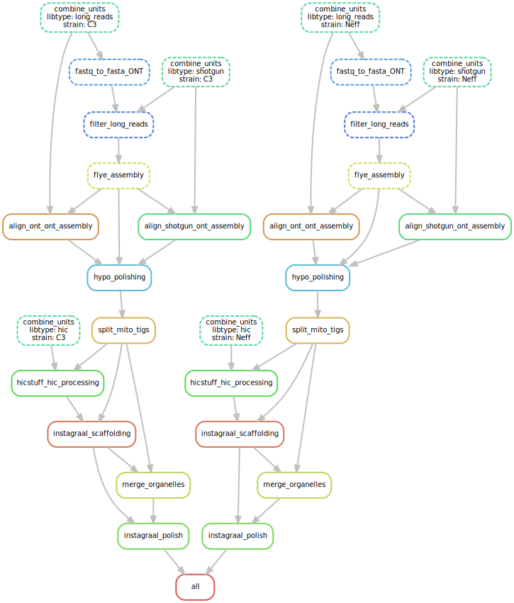

### Acanthamoeba castellanii Hybrid assembly pipeline

This repository contains an automatic and reproducible pipeline for the genome assembly of Acanthamoeba castellanii. The different steps of the pipeline are illustrated below.
The analysis is implemented by combining the snakemake workflow system with [singularity containers](https://snakemake.readthedocs.io/en/stable/snakefiles/deployment.html#singularity).

#### Dependencies

* python >=3.7
* snakemakea >= 5.5
* singularity >= 3.2

#### Usage

To run the analyses, columns `fq1` and `fq2` in `units.tsv` should be edited to match the path of fastq files on the system. Lines `out_dir` and `tmp_dir` should also be edited to match desired output paths. The pipeline can be started using:

```bash
snakemake --use-singularity
```

If your datafiles are not in the working directory, you should also bind mount the data folder. For example if input files are in `/data`:
```bash
snakemake --use-singularity --singularity-args "-B /data:/data/"
```
This will mount the `/data` folder of the system into a `/data` volume in the container (so that the target paths in `units.tsv` are preserved).

#### Pipeline steps
The pipeline uses 3 types of input data:
 * shotgun Illumina reads
 * Hi-C Illumina reads
 * Oxford Nanopore long reads

The initial assembly is performed with long reads only using Flye. The short reads are then used to polish this assembly using pilon and racon. The Hi-C scaffolding is done using instagraal, followed by another round of pilon polishing to remove misassemblies introduced during scaffolding.

TODO: Add long reads scaffolding using LINKS

TODO: Add quast report at the end of the pipeline

Each rule requiring a third party software pulls a standalone container hosted on dockerhub to work in an isolated environment with a fixed version of the software.


